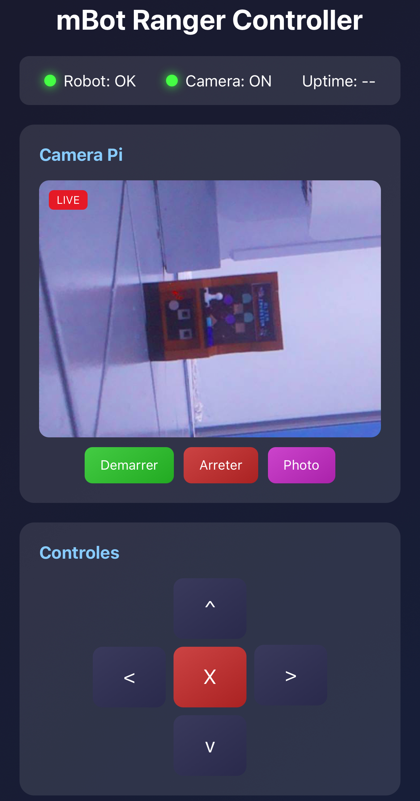
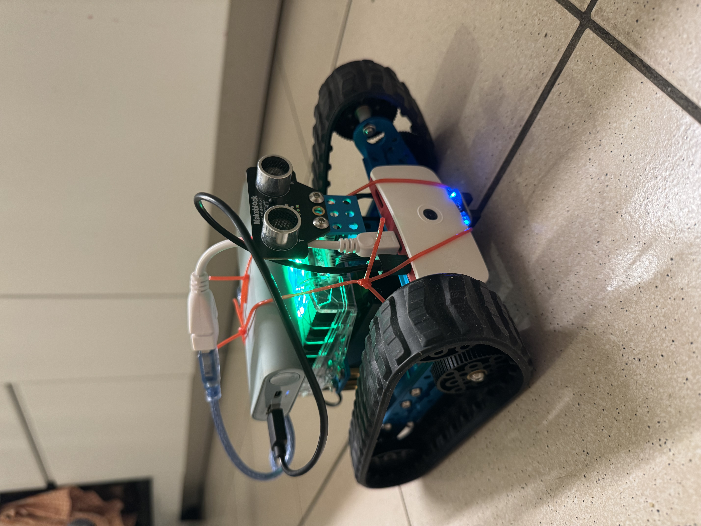

# mBot Ranger Pi Notifier

Interface between mBot Ranger and Raspberry Pi for sending email notifications and controlling the robot via a web interface.

## Overview

<table>
<tr>
<td width="50%">

<p align="center"><em>Web interface with camera streaming</em></p>
</td>
<td width="50%">

<p align="center"><em>mBot Ranger with mounted Raspberry Pi</em></p>
</td>
</tr>
</table>

## Architecture

```
┌─────────────────┐     USB/Serial     ┌─────────────────┐     Internet     ┌─────────────┐
│   mBot Ranger   │ ◄────────────────► │  Raspberry Pi   │ ───────────────► │    Email    │
│   (Arduino)     │    JSON 115200     │   (Python)      │      SMTP        │   Server    │
└─────────────────┘                    └─────────────────┘                  └─────────────┘
       │                                       │
       ▼                                       ▼
  Ultrasonic sensor                    pi_notifier.py (CLI)
  LEDs, Buzzer                         web_controller.py (Web)
  Motors                               Browser interface
```

## Features

### Detections (Arduino → Pi)
- **Obstacle**: Object detected within 30 cm
- **Motion**: Distance change > 15 cm
- **Button**: Built-in button press
- **Light**: Light level change (optional)

### Control (Pi → Arduino)
- Start/stop monitoring
- Control LEDs
- Move the robot
- Play sounds

### Web Interface
- Real-time control via browser
- Sensor display (distance, light)
- Alert history
- Keyboard shortcuts (arrow keys, WASD)
- **Live video streaming** from Pi camera
- Snapshot capture

## Required Hardware

### mBot Ranger
- Me Auriga board
- Ultrasonic sensor (port 10)
- USB cable

### Raspberry Pi
- Raspberry Pi (any model with USB)
- Internet connection (WiFi or Ethernet)
- Python 3.x
- **Optional**: Pi Camera or USB webcam

## Installation

### 1. mBot Ranger Side

1. Open `mbot-ranger-pi-notifier.ino` in Arduino IDE
2. Select **Tools > Board > Arduino Mega 2560**
3. Upload the program

### 2. Raspberry Pi Side

```bash
# Install dependencies (CLI only)
pip3 install pyserial

# Install dependencies (with web interface)
pip3 install pyserial flask flask-socketio

# Install camera dependencies (optional)
# For Pi Camera (recommended on Raspberry Pi):
pip3 install picamera2 opencv-python
# For USB webcam only:
pip3 install opencv-python

# Clone the project (or copy the files)
cd /home/pi
git clone <repo_url>
cd mbot-ranger-pi-notifier

# Create configuration (for emails)
cp config.example.json config.json
nano config.json  # Edit with your settings
```

### 3. Email Configuration (Gmail)

For Gmail, you need to create an **app password**:

1. Enable 2-step verification on your Google account
2. Go to: Google Account > Security > App passwords
3. Create a new password for "Mail" on "Other"
4. Use this password in `config.json`

## Usage

### Connecting the Robot

1. Connect the mBot Ranger to the Raspberry Pi via USB
2. Find the serial port:
   ```bash
   ls /dev/ttyUSB*
   # or
   ls /dev/ttyACM*
   ```

### Starting Monitoring

```bash
# With default port (/dev/ttyUSB0)
python3 pi_notifier.py

# With a specific port
python3 pi_notifier.py --port /dev/ttyACM0

# With a configuration file
python3 pi_notifier.py --config config.json

# Debug mode
python3 pi_notifier.py --debug
```

### Interactive Mode

```bash
python3 pi_notifier.py --interactive

mBot> start      # Start monitoring
mBot> status     # Get status
mBot> led_red    # Red LED
mBot> forward    # Move forward
mBot> quit       # Quit
```

### Web Interface

```bash
# Start web server (accessible on the entire network)
python3 web_controller.py

# With a specific port
python3 web_controller.py --web-port 8080

# With a specific serial port
python3 web_controller.py --port /dev/ttyACM0

# Debug mode
python3 web_controller.py --debug
```

Open in a browser: `http://<raspberry-ip>:5000`

**Web interface features:**
- **Live video streaming** from Pi/USB camera
- **Virtual joystick** with touch support for precise control
- **Person detection** with multiple algorithms
- LED and sound control
- Real-time sensor display
- Alert history
- Snapshot capture

### Virtual Joystick

The interface provides a virtual joystick for precise robot control:

- **Touch/mouse control**: Drag the joystick in the desired direction
- **Variable speed**: The further the joystick is from center, the faster the robot moves
- **Speed slider**: Adjust maximum speed (50-255)
- **Directions**: Forward, backward, left/right rotation, turns

**Keyboard shortcuts:**
| Key | Action |
|-----|--------|
| ↑ or W | Move forward |
| ↓ or S | Move backward |
| ← or A | Turn left |
| → or D | Turn right |
| Space | Emergency stop |

### Person Detection

The system offers 4 detection algorithms:

| Algorithm | Description | Performance | Accuracy |
|-----------|-------------|-------------|----------|
| **Motion** | Frame difference detection | Very fast | All movement |
| **Face (Haar)** | Haar cascade for faces | Fast | Faces only |
| **Body (HOG)** | Histogram of oriented gradients | Medium | Full body |
| **MobileNet SSD** | Neural network | Slow | Very accurate |

**Available settings:**
- **Sensitivity** (0-100%): Higher = detects more easily
- **Cooldown** (1-30s): Delay between two alerts
- **Sound alarm**: Play alarm on the robot
- **Red LED**: Turn on LED upon detection

**Detection display:**
Detections are shown in real-time on the video feed with colored rectangles:
- 🟡 **Yellow**: Motion detected
- 🟣 **Magenta**: Face detected
- 🟢 **Green**: Person (HOG)
- 🟠 **Orange**: Person (MobileNet)

### Camera Options

```bash
# Disable camera
python3 web_controller.py --no-camera

# Camera rotation (0, 90, 180, 270 degrees)
python3 web_controller.py --camera-rotation 180

# Camera auto-detects:
# 1. Pi Camera (via picamera2)
# 2. USB Webcam (via OpenCV)
```

**Interface controls:**
- **Rotation**: 0°, 90°, 180°, 270° buttons to orient the image
- **Swap colors**: Fixes R/B inversion on some cameras (enabled by default for Pi Camera)

## Configuration

### config.json

```json
{
  "serial_port": "/dev/ttyUSB0",
  "baud_rate": 115200,
  "email": {
    "enabled": true,
    "smtp_server": "smtp.gmail.com",
    "smtp_port": 587,
    "sender_email": "your_email@gmail.com",
    "sender_password": "app_password",
    "recipient_email": "recipient@email.com"
  },
  "alerts": {
    "obstacle": true,
    "motion": true,
    "button": true,
    "light": false
  },
  "cooldown_seconds": 60
}
```

### Parameters

| Parameter | Description |
|-----------|-------------|
| `serial_port` | Robot serial port |
| `email.enabled` | Enable email sending |
| `alerts.*` | Alert types to notify |
| `cooldown_seconds` | Delay between identical alerts |

## Communication Protocol

### JSON Messages (Arduino → Pi)

**Alert:**
```json
{
  "type": "alert",
  "alert": "obstacle",
  "message": "Obstacle detected nearby",
  "value": 25.5,
  "timestamp": 12345
}
```

**Status:**
```json
{
  "type": "status",
  "distance": 150.0,
  "baseline": 200.0,
  "light": 512,
  "monitoring": true,
  "uptime": 3600
}
```

**Heartbeat:**
```json
{
  "type": "heartbeat",
  "uptime": 3600
}
```

### Commands (Pi → Arduino)

| Command | Description |
|---------|-------------|
| `start` / `monitor` | Start monitoring |
| `stop` | Stop monitoring |
| `status` | Request status |
| `calibrate` | Recalibrate sensors |
| `ping` | Connection test |
| `led_red/green/blue/off` | Control LEDs |
| `beep` | Play a beep |
| `alarm` | Play alarm |
| `forward/backward/left/right` | Move the robot |
| `obstacle_on/off` | Enable/disable obstacle alerts |
| `motion_on/off` | Enable/disable motion alerts |

## systemd Service (optional)

To start automatically at boot:

### CLI Service (email notifications)

```bash
sudo nano /etc/systemd/system/mbot-notifier.service
```

```ini
[Unit]
Description=mBot Ranger Pi Notifier
After=network.target

[Service]
Type=simple
User=pi
WorkingDirectory=/home/pi/mbot-ranger-pi-notifier
ExecStart=/usr/bin/python3 pi_notifier.py --config config.json
Restart=always
RestartSec=10

[Install]
WantedBy=multi-user.target
```

### Web Service (browser interface)

```bash
sudo nano /etc/systemd/system/mbot-web.service
```

```ini
[Unit]
Description=mBot Ranger Web Controller
After=network.target

[Service]
Type=simple
User=pi
WorkingDirectory=/home/pi/mbot-ranger-pi-notifier
ExecStart=/usr/bin/python3 web_controller.py --port /dev/ttyUSB0
Restart=always
RestartSec=10

[Install]
WantedBy=multi-user.target
```

### Enabling Services

```bash
# For CLI service
sudo systemctl enable mbot-notifier
sudo systemctl start mbot-notifier

# For Web service
sudo systemctl enable mbot-web
sudo systemctl start mbot-web

# Check status
sudo systemctl status mbot-notifier
sudo systemctl status mbot-web
```

## Troubleshooting

### Serial port not found
```bash
# List ports
ls -la /dev/ttyUSB* /dev/ttyACM*

# Add user to dialout group
sudo usermod -a -G dialout $USER
# Then log out and back in
```

### Permission denied on port
```bash
sudo chmod 666 /dev/ttyUSB0
# or
sudo usermod -a -G dialout pi
```

### Emails are not being sent
- Check Internet connection
- Verify SMTP settings
- For Gmail: use an app password
- Check logs: `python3 pi_notifier.py --debug`

### Robot not responding
- Check USB connection
- Verify the correct port is being used
- Restart the robot

## Usage Examples

### Room Surveillance
1. Place the robot in the room
2. Start the script on the Pi
3. Receive an email if someone enters

### Connected Alarm
1. Combine with the Guardian project
2. Modify the script to send SMS (Twilio)
3. Add a Pi camera to capture images

### Home Automation
1. Integrate with Home Assistant
2. Trigger actions on detection
3. Control the robot via home automation interface

## License

MIT License
